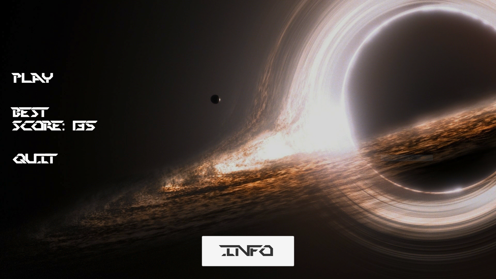
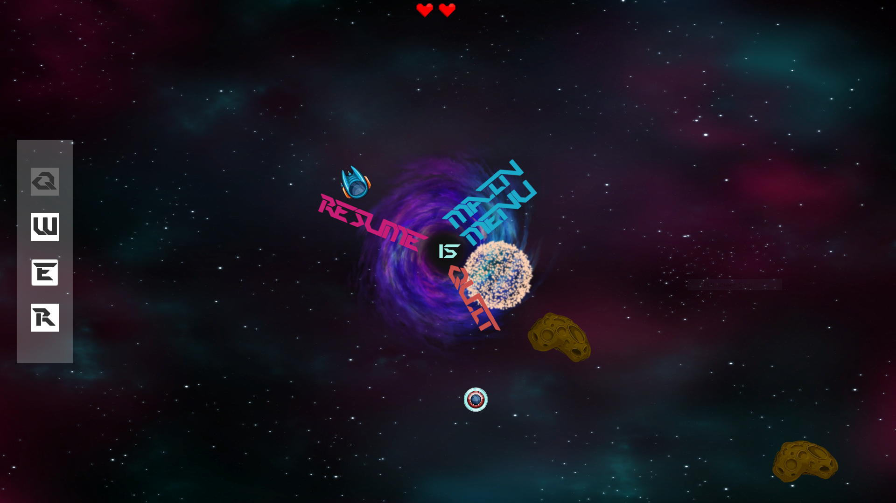

# Gravity 2D

University of Bucharest - Faculty of Mathematics and Computer Science - Game Programming Course - Team 9's project
   
## Description
   The game uses as insiration the strongest spatial event ever recorded which is THE BLACK HOLE. The player represents a kind entity with access to advanced technologies who has the mission of saving spatial ships from an iminent death. All things considered, this mission is not easy to accomplish because of the black hole's gravitational pull which attracts many dangerous spatial objects.
   
   Reflexes and action time represent key components in mastering this game.
   
   
   
   
      

## Player 
   The player moving system uses horizontal and vertical input from arrow keys, allowing for movement in 8 possible directions. Also the access to advanced technology provides unique and usefull abilities to the protagonist:
   
      * Super speed - Short time speed burst applied to the player's rigidbody - Cooldown : 10
      * Health Magnet - Strong magnet which pulls asteroids that heal the player on collision - Cooldown : 10
      * Shield - Short period of time immunity on collision with harmfull spatial objects - Cooldown : 8
      * Snap - Strong burst of gamma energy that saves every ship and destroys all harmfull spatial objects - Cooldown : 25
   
## Spatial Objects
   Every spatial object ( asteroid or space ship ) is instatiated outside of the game screen and follows a direction to the black hole's center via script. 
   In the case of space ships, Awake() method is used to store the initial spawn position and in case of rescue this initial position becomes the new destination of the space ship gameObject. Also as an optimization step once outside of screen boundaries the rescued objects are destroyed.
   
   Object speed is chosen randomly upon initialization for more diversity.
   
## Spawn Manager
   The spawn system uses Coroutines and Random.Range to instantiate spatial objects outside of gameScreen in a random manner ( spatial objects can be pulled to the black hole from any direction) and in time intervals that decrease over time (increasing difficulty).
   
## Effects
   Explosions and other special effects were created using the Unity build-in particle system which is easy to use.
      
## Assets 

      - https://pngimage.net/green-cross-png/
      - https://webstockreview.net/pict/getfirst
      - https://www.seekpng.com/ipng/u2q8a9i1r5r5e6a9_energy-shield-png-energy-shield-transparent/
      - http://adamfelstead95.blogspot.com/2015/10/character-proposal.html
      - https://graphicriver.net/space-and-sprite-graphics-in-game-assets
      - Google images 
      
## https://docs.unity3d.com/ScriptReference/ - Unity's documentation was used to better understand the behaviour of different methods used to create the game.
